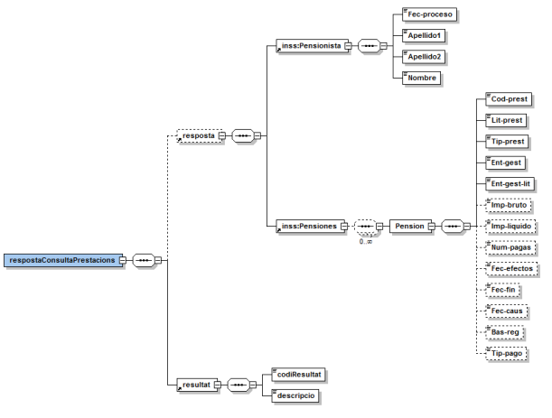
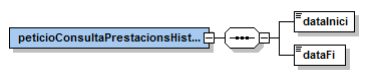
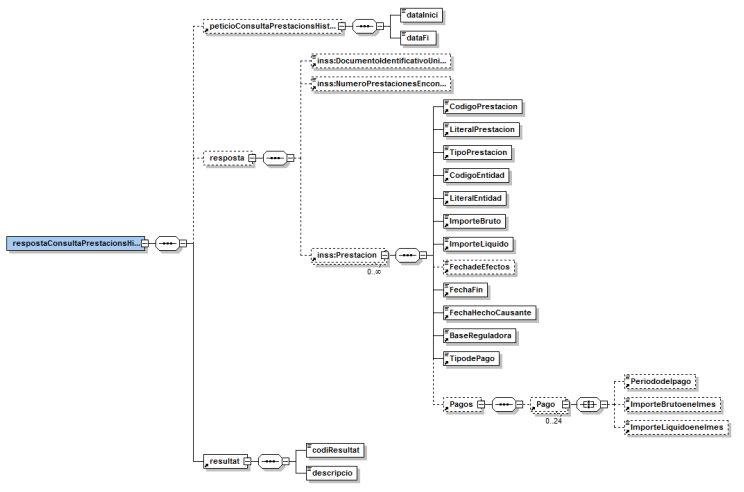

# Via Oberta – INSS
Documentació d'integració del servei INSS del Consorci AOC.

# **Índex** #

1. [Introducció](#1)
2. [Transmissions de dades disponibles](#2)
3. [Missatgeria del servei](#3)
   1. [Consulta de prestacions (PRESTACIONS)](#3.1)
      1. [Petició – dades genèriques](#3.1.1)
      2. [Resposta – dades específiques ](#3.1.2)
   2. [Consulta d’històric de prestacions (PRESTACIONS_HISTORIC)](#3.2)
      1. [Petició – dades genèriques](#3.2.1)
      2. [Petició – dades específiques](#3.2.2)
      3. [Resposta – dades específiques](#3.2.3)
4. [Joc de proves](#4)

## 1 Introducció <a name="1"></a>

Aquest document detalla la missatgeria associada al servei de consulta de prestacions de l’Instituto
Nacional de la Seguridad Social (en endavant INSS).

Per a poder realitzar la integració cal conèixer prèviament la següent documentació:

- [Document de Missatgeria Genèrica de la PCI del Consorci AOC.][PCI]

[PCI]:https://github.com/ConsorciAOC/PCI


## 2 Transmissions de dades disponibles <a name="2"></a>

Les dades disponibles a través del servei són les que es presenten a continuació:

- **EMISSOR**: INSS (Instituto Nacional de la Seguridad Social)

| **PRODUCTE** | **MODALITAT** | **DESCRIPCIO** |
| --- | --- | --- |
| **PRESTACIONS_SOCIALS** | PRESTACIONS | Consulta de les prestacions del Registre de Prestacions Socials Públiques, Incapacitat Temporal i Maternitat (RPSP).
|  | PRESTACIONS_HISTORIC | Consulta de l’històric de les prestacions del Registre de Prestacions Socials Públiques,Incapacitat Temporal, Maternitat i Paternitat.

Totes les consultes del producte tenen disponible la versió imprimible del resultat de la consulta en
format PDF. Per més detalls adreceu-vos a l’apartat Extensions de missatgeria del document de
missatgeria genèrica.

## 3 Missatgeria dels serveis <a name="3"></a>

A continuació es detalla la missatgeria corresponent al bloc de dades específiques de les modalitats
de consum del producte.

```
L’emissor de les dades^ requereix que s’informin les dades del funcionari que realitza la
consulta. Així, cal informar l’element Funcionario del bloc de dades genèriques:
/Peticion/Funcionario i //SolicitudTransmision/DatosGenericos/Solicitante/Funcionario.
```

### 3.1 Consulta de prestacions (PRESTACIONS) <a name="3.1"></a>

La consulta es realitza mitjançant document identificatiu (NIF, NIE o passaport). Amb el document
s’accedeix al fitxer general de persones físiques i si està unívocament identificat i és titular d’alguna
prestació es retornen tants registres com número de prestacions en alta tingui el titular en el RPSP.

Per altra banda, es retornaran fins a 20 possibles prestacions d’incapacitat temporal i/o prestacions de
maternitat i paternitat. La suma de totes elles no superarà mai 35 prestacions.

Es obligatori informar la dada consentiment ja que en funció d’aquest la resposta pot variar en
determinats camps.

#### 3.1.1 Petició – dades genèriques <a name="3.1.1"></a>

| _Element_ | _Descripció_ |
| --- | --- |
//DatosGenericos/Titular/TipoDocumentacion | Tipus de documentació (NIF, Pasaporte, NIE).
//DatosGenericos/Titular/Documentacion | Documentació.
//DatosGenericos/Titular/Nombre</br>//DatosGenericos/Titular/Apellido</br>//DatosGenericos/Titular/Apellido | Nom i cognoms. Requerits quan existeixen múltiples persones amb el mateix identificador.
//DatosGenericos/Solicitante/Consentimiento | Es té el consentiment del ciutadà per fer la consulta? (Si / Ley).

#### 3.1.2 Resposta – dades específiques <a name="3.1.2"></a>

<p align="center">

</p>

| _Element_ | _Descripció_ |
| --- | --- |
//respostaConsultaPrestacions/resposta | Bloc de dades corresponent a la informació sobre les prestacions.
//resposta/Pensionista/Fec-proceso | Data de la petició / vigència de les dades.
//resposta/Pensionista/Apellido | Primer cognom del titular.
//resposta/Pensionista/Apellido | Segon cognom del titular.
//resposta/Pensionista/Nombre | Nom del titular.
//resposta/Pensiones/Pension | Bloc de dades corresponent a la informació d’una prestació del titular.
//Pension/Cod-prest | Clau de prestació (vegeu l’apartat 3.1.2.1).
//Pension/Lit-prest | Nom genèric si hi ha consentiment de l’interessat. Si no hi ha consentiment el literal serà fix: PRESTACION.
//Pension/Tip-prest | Característica de la prestació: <ul><li>SI: contributiva.</li><li>NO: no contributiva.</li><li>En blanc: desconeguda.</li></ul></br>Totes les prestacions són contributives a excepció de la Protecció familiar (A2). Maternitat pot ser-ho o no.</br></br>Són NO contributives les gestionades per les CCAA (claus d’entitat gestora C), les prestacions de la A50 (Junta d’Andalusia) i les A52 (pensions assistencials).</br></br>La resta de prestacions són majoritàriament contributives tot i que en alguns casos no està clarament identificada la característica per la qual cosa, el valor anirà en blanc.
//Pension/Ent-gest | Clau de l’entitat gestora que abona la prestació.</br></br>La clau serà un valor numèric en prestacions d’IT, maternitat i paternitat i alfanumèric per la resta de prestacions.
//Pension/Ent-gest-lit | Nom de l’entitat gestora que abona la prestació.
//Pension/Imp-bruto | Import brut mensual en cèntims d’euro (format NNNNNNN).</br></br>Correspon a l’import de la prestació, inclosos els imports de possibles deduccions més import de IRPF (si s’escau). Pot haver-hi prestacions amb import brut igual a 0.</br></br>Per totes les prestacions del RPSDP es retorna l’import mensual de la prestació a data de la consulta.</br></br>Per a prestacions M6 o P6 de pagament directe, l’import brut serà l’import abonat fins el moment de la consulta.</br></br>Si hi ha parts de confirmació capturats però no abonat, es calcularà el pagament i s’inclourà en l’imprt brut.</br></br>Quan l’import sigui zero es mostrarà el valor i etiqueta per prestacions RPSP i INCA pagament directe (tipus de pagament 1 ). No es mostrarà quan la prestació sigui INCA i pagament delegat (tipus de pagament 2 o 0 ).
//Pension/Imp-liquido | Import líquid mensual en cèntims d’euro (formatNNNNNNN).</br></br>Correspon a l’import de la prestació, inclosos els imports de possibles deduccions més import de IRPF (si s’escau). Pot haver-hi prestacions amb import líquid igual a 0 per que es parteix d’un import brut igual a 0 o per que és 0 després d’aplicar les deduccions corresponents.</br></br>En totes les prestacions alienes al Sistema de la Seguretat Social l’import líquid coincidirà amb el brut ja que no es disposa de dades de possibles descomptes.</br></br>Quan l’import sigui zero es mostrarà el valor i etiqueta per prestacions RPSP i INCA pagament directe (tipus de pagament 1 ). No es mostrarà quan la prestació sigui INCA i pagament delegat (tipus de pagament 2 o 0 ).
//Pension/Num-pagas | Número de pagues de la prestació en el període d’un any.
//Pension/Fec-efectos | Data d’efectes econòmics de la prestació (AAAAMMDD).
//Pension/Fec-fin | Es correspon amb la data del fi del dret. No es retornarà la dada per les prestacions del RPSP.</br></br>Si és maternitat o paternitat es correspon amb la data de venciment del subsidi.</br></br>Si és incapacitat temporal es la data del darrer pagament realitzat en el pagament directe INSS.
//Pension/Fec-causa | Data de baixa mèdica en IT o data d’inici de descans en cas de maternitat.</br></br>No es retornarà la dada per les prestacions del RPSP.
//Pension/Bas-reg | Base reguladora diària en el cas de pagamentdelegat.
//Pension/Tip-pago | Per subsidis: <ul><li>1 : directe.</li><li>2 : delegat</li><li>No s’informa per prestacions R.P.S.P.</li></ul>
//respostaConsultaPrestacions/resultat /descripcio | Descripció del resultat.
//respostaConsultaPrestacions/resultat/codiResultat | Codi de resultat:<ul><li>0000 : titular amb prestacions localitzat.</li><li>0001 : documentació del titular incorrecta.</li><li>0002 : existeixen múltiples titulars pel mateix identificador.</li><li>0003 : titular no té prestacions.</li><li>0004 : prestacions trobades però no es retorna la totalitat de les mateixes ja que existeixen més de 20 prestacions d’IT o més de 35 prestacions en total (llindar màxim establert per l’emissor).</li><li>0005 : retorna prestacions de RPSP si en té però si n'hi hagués d'IT no es retornen degut a un error de comunicacions intern de l'emissor.</li><li>0006 : persona especialment protegida. Es retornen dades de les prestacions però aquestes dades han de tenir una protecció especial a l'hora de tractar-los per desig del titular de la prestació.</li><li>0502 : error realitzant la consulta.</li></ul>

##### 3.1.2.1 Prestacions

| Clau | Literal |
| --- | --- |
A2 | PROTECCION FAMILIAR
J0 | JUB. DERIVADA INCAPACIDAD PERMANENTE
J1 | JUBILACION INCAPACIDAD ABSOLUTA
J2 | JUBILACION INCAPACIDAD TOTAL
J3 | JUBILACION INCAPACIDAD PARCIAL
J4 | JUBILACION GRAN INVALIDEZ
I6 | INCAPACIDAD TEMPORAL CONTING. COMUNES
I7 | INCAPACIDAD TEMPORAL CONT. PROFESIONALES
M6 | MATERNIDAD
P6 | PATERNIDAD
10 | INCAPACIDAD PERMANENTE
11 | INCAPACIDAD ABSOLUTA
12 | INCAPACIDAD TOTAL
13 | INCAPACIDAD PARCIAL
14 | GRAN INVALIDEZ
19 | INCAPACIDAD
20 | JUBILACION
28 | JUB. DERIVADA INCAPACIDAD
30 | VIUDEDAD
40 | ORFANDAD
50 | FAVOR FAMILIARES
60 | MEJORA ESTATUTARIA
69 | PF, P. COMPLEMENTARIA
71 | AYUDA EXTRAORDINARIA LISMI
72 | SUBS.GAR. ING.MINIM
73 | SUBS. AYUDA T. PERSONA
74 | SUBS. MOV. COMP GASTOS TRANSPORTE
79 | SUBS. DESEM. > 52/REAS
89 | MENORES GUERRA
99 | OTROS COLECTIVOS
7A | AYUDA EMERGENCIA SOCIAL
7R | RENTA INSERCION

### 3.2 Consulta d’històric de prestacions (PRESTACIONS_HISTORIC) <a name="3.2"></a>

#### 3.2.1 Petició – dades genèriques <a name="3.2.1"></a>

| _Element_ | _Descripció_ |
| --- | --- |
//DatosGenericos/Titular/TipoDocumentacion | Tipus de documentació (DNI, Pasaporte, NIE).
//DatosGenericos/Titular/Documentacion | Documentació.
//DatosGenericos/Titular/Nombre</br>//DatosGenericos/Titular/Apellido</br>//DatosGenericos/Titular/Apellido | Nom i cognoms. Requerits en cas d’IPF duplicat.
//DatosGenericos/Solicitante/Consentimiento | Es té el consentiment del ciutadà per fer la consulta? (Si / Ley).

#### 3.2.2 Petició – dades específiques <a name="3.2.2"></a>

| _Element_ | _Descripció_ |
| --- | --- |
//peticioConsultaPrestacionsHistoric/dataInici | Data d’inici del període a consultar (AAAA-MM-DD). La consulta no es podrà realitzar per una data anterior a l’1 de gener de l’any anterior a la data de la petició.
//peticioConsultaPrestacionsHistoric/dataFi | Data de fi del període a consultar (AAAA-MM-DD). La consulta no es podrà realitzar amb data posterior a la data de la petició.

<p align="center">

</p>

#### 3.2.3 Resposta – dades específiques <a name="3.2.3"></a>

<p align="center">

</p>

| _Element_ | _Descripció_ |
| --- | --- |
//respostaConsultaPrestacionsHistoric/peticioConsultaPrestacionsHistoric | Bloc de dades corresponent a la petició que origina la resposta.
//respostaConsultaPrestacionsHistoric/resposta | Bloc de dades corresponent a la informació sobre les prestacions.
//resposta/DocumentoIdentificativoUnivoco | Indica si el document identificatiu és unívoc:<ul><li>S: és unívoc.</li><li>N: el document és duplicat i requereix informar nom i cognoms a la petició.</li></ul>
//resposta/NumeroPrestacionesEncontradas |Número de prestacions: si és superior a 35, només retorna les 35 primeres.
//resposta/Prestacion | Bloc de dades corresponent a una prestació.
//Prestacion/CodigoPrestacion | Clau de la prestació obtinguda:<ul><li>I0: Incapacitat temporal.</li><li>I6: Incapacitat temporal per contingències comuns.</li><li>I7: Incapacitat temporal per contingències professionals.</li><li>M6: Naixement i cura del menor contributiva.</li><li>M7 :Naixement i cura del menor no contributiva.</li><li>
//Prestacion/LiteralPrestacion | Nom genèric si hi ha consentiment de l’interessat. Si no hi ha consentiment s’informa PRESTACION.
//Prestacion/TipoPrestacion | Tipus de prestació:<ul><li>SI: contributiva.</li><li>NO: no contributiva.</li><li>En blanc: desconeguda.</li></ul></br>Totes les prestacions del Sistema de la Seguretat Social són contributives amb l'excepció de la Protecció Familiar (clau de prestació A1, A2 i A3). La maternitat pot ser o no ser-ho.
//Prestacion/CodigoEntidad | Clau de l’entitat gestora o que abona laprestació (vegeu l’apartat 3.2.3.1).
//Prestacion/LiteralEntidad | Nom de l’entitat gestora o que abona laprestació.
//Prestacion/ImporteBruto | Import brut en cèntims d’euro.<ul><li>Es correspon amb l'import de la prestació en cèntims d'euro, inclosos els imports de possibles deduccions, més l'import d'IRPF (si s'escau).</li><li>Hi pot haver prestacions amb import brut igual a zero.</li><li>Aquesta dada només s'ofereix per a les prestacions abonades en pagament directe per l'INSS (totes les maternitats i paternitats i algunes incapacitats temporals) i contindrà l'import brut de la prestació.</li></ul>
//Prestacion/ImporteLiquido | Import líquid en cèntims d’euro.<ul><li>Informada únicament en cas que el codi de resposta sigui 0000 i hi hagi alguna prestació.</li><li>Aquesta dada només s'ofereix per a les prestacions abonades en pagament directe per l'INSS (totes les maternitats i paternitats i algunes incapacitats temporals).</li><li>Es correspon amb l'import de la prestació en cèntims d'euro una vegada aplicades les possibles deduccions, més l'import d'IRPF (si s'escau).</li><li>Hi pot haver prestacions amb líquid igual a zero, bé perquè es parteix d'un brut d'import zero, o perquè és zero després d'aplicar les deduccions corresponents.</li></ul>
//Prestacion/FechadeEfectos | Data d’efectes de la prestació (AAAA-MM-DD).<ul><li>Es correspon amb la data d'efectes econòmics de la prestació.</li><li>Es tornarà en tots els casos, excepte en les prestacions d'incapacitat temporal (I o I7) que només figurin en l'aplicació INCA PAGO DELEGADO ja sigui la prestació en Pagament directe o en Pagament Delegat.</li></ul>
//Prestacion/FechaFin | Data de finalització del dret de la prestació econòmica (AAAA-MM-DD).<ul><li>Data del darrer pagament directe INSS per incapacitat temporal.</li><li>Data finalització en pagament directe per maternitats i paternitats.</li></ul>
//Prestacion/FechaHechoCausante | Data de fet causant (AAAA-MM-DD).<ul><li>Data de baixa mèdica en cas d’incapacitat temporal.</li><li>Data d’inici de descans en cas de maternitat.</li></ul>
//Prestacion/BaseReguladora |Base reguladora diària en el cas de Pagament Delegat de la incapacitat temporal.
//Prestacion/TipodePago | Tipus de pagament de la prestació:<ul><li>1 : directe.</li><li>2 : delegat.</li><li>3 : mútua.</li><li>En blanc: desconegut.</li></ul>
//Prestacion/Pagos/Pago | Bloc de dades corresponent a un pagament.
//Pago/Periododelpago | Mes en el que s’ha realitzat el pagament.
//Pago/ImporteBrutoenelemes | Import brut pagat en el mes en cèntimsd’euro.
//Pago/ImporteLiquidoenelemes | Import líquid pagat en el mes en cèntims d’euro.
//respostaConsultaPrestacionsHistoric/resultat/descripcio | Descripció del resultat.
//respostaConsultaPrestacionsHistoric/resultat/codiResultat | Codi de resultat:<ul><li>0000 : titular amb prestacions localitzat.</li><li>0001 : titular no té prestacions.</li><li>1105 : titular amb IPF duplicat. Cal informar nom i cognoms a la petició.</li><li>1200 : data inicial menor que la permesa.</li><li>1235 : prestacions trobades però no es retorna la totalitat de les mateixes ja que existeixen més de 35 prestacions (llindar màxim establert per l’emissor).</li><li>0502 : error realitzant la consulta.</li></ul>

##### 3.2.3.1 Entitats gestores

| Clau | Literal |
| --- | --- |
001 | MUTUAL MIDAT CYCLOPS
002 | MUTUALIA
003 | ACTIVA MUTUA 2008
007 | MUTUA MONTAÑESA
010 | MUTUA UNIVERSAL MUGENAT
011 | MAZ, MUTUA DE ACCIDENTES DE ZARAG
015 | UMIVALE
021 | MUTUA NAVARRA
039 | MUTUA INTERCOMARCAL
061 | FREMAP
072 | SOLIMAT
115 | MUTUA DE ANDALUCIA Y DE CEUTA
151 | ASEPEYO
183 | MUTUA BALEAR
201 | MUTUA GALLEGA DE AT
267 | UNION MUTUAS UNIMAT
272 | MAC, MUTUA DE ACCIDENTES DE CANARIAS
272 | IBERMUTUAMUR
275 | FRATERNIDAD-MUPRESPA
276 | EGARSAT
777 | I.N.S.S
888 | INSTITUTO SOCIAL DE LA MARINA

# 4 Joc de proves <a name="4"></a>


L&#39;emissor final publica els següent [joc de proves a l&#39;entorn de pre-producció][proves] 

[proves]: https://administracionelectronica.gob.es/ctt/svd/descargas#.YvOZNXbP2Ul
 En cas de tindre problemes per accedir als jocs de proves, si us plau, obre un tiquet a través del [formulari][form]

[form]:https://suport.aoc.cat/hc/ca/requests/new
